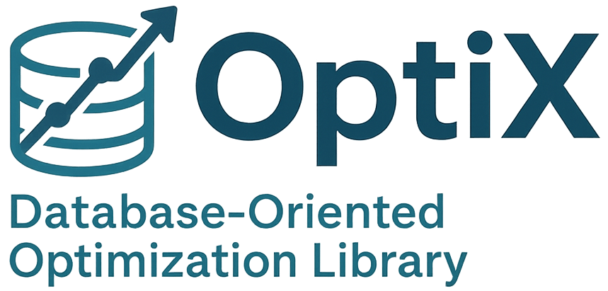

OptiX - Mathematical Optimization Framework
==========================================

|

.. raw:: html

   

     
     
     
     
     
   

Welcome to **OptiX**, a comprehensive Python framework for mathematical optimization problems, supporting 
linear programming (LP), goal programming (GP), and constraint satisfaction problems (CSP). Built with 
multi-solver architecture and advanced constraint modeling capabilities.

System Overview
---------------

OptiX provides a hierarchical problem-solving framework with increasing complexity, designed to handle 
real-world optimization challenges across diverse domains including operations research, supply chain 
management, resource allocation, and decision support systems.

Core Architecture
~~~~~~~~~~~~~~~~~

.. raw:: html

   

     

       <h3>🚀 Hierarchical Problem Types</h3>
       
Progressive complexity from CSP → LP → GP with unified modeling interface

     

     

       <h3>🔧 Multi-Solver Support</h3>
       
OR-Tools and Gurobi integration with extensible solver interface

     

     

       <h3>⚡ Advanced Constraints</h3>
       
Special constraints for non-linear operations: multiplication, division, modulo, conditional logic

     

     

       <h3>🗄️ Database Integration</h3>
       
Built-in data management with OXData and OXDatabase for complex optimization scenarios

     

     

       <h3>📈 Goal Programming</h3>
       
Multi-objective optimization with goal constraints and deviation variables for conflicting objectives

     

     

       <h3>🧪 Comprehensive Testing</h3>
       
Full test coverage with real-world examples including bus assignment and diet optimization problems

     

     

       <h3>🔍 Variable Management</h3>
       
Flexible variable creation from database objects using Cartesian products

     

     

       <h3>📊 Solution Management</h3>
       
Comprehensive solution tracking, analysis, and multi-scenario optimization

     

   

Key Features
~~~~~~~~~~~~

**Modeling Capabilities:**

- **🎛️ Flexible Modeling**: Create decision variables, constraints, and objective functions with intuitive APIs
- **📱 Special Constraints**: Non-linear operations including multiplication (×), division (÷), modulo (mod), and conditional (if-then) logic
- **🔄 Database Integration**: Object-relational mapping for complex data structures with automatic variable generation
- **📋 Scenario Management**: Built-in support for multi-scenario optimization and sensitivity analysis

**Solver Integration:**

- **🌐 Multi-Solver Architecture**: Unified interface supporting OR-Tools (open-source) and Gurobi (commercial)
- **⚡ Performance Optimization**: Efficient problem setup, constraint translation, and solution extraction
- **🔧 Extensible Design**: Easy integration of custom solvers through standardized interfaces
- **📈 Parallel Solving**: Support for concurrent solver execution and performance comparison

**Real-World Applications:**

- **📋 Operations Research**: Supply chain optimization, resource allocation, scheduling problems
- **🏭 Production Planning**: Manufacturing optimization, inventory management, capacity planning
- **🚌 Transportation**: Route optimization, vehicle assignment, logistics planning
- **💰 Financial Modeling**: Portfolio optimization, risk management, investment planning

Quick Start
-----------

Install OptiX using Poetry:

.. code-block:: bash

   # Clone the repository
   git clone https://github.com/yourusername/optix.git
   cd OptiX

   # Install dependencies
   poetry install

   # Activate virtual environment
   poetry shell

Create your first optimization problem:

.. code-block:: python

   from problem import OXLPProblem, ObjectiveType
   from constraints import RelationalOperators
   from solvers import solve

   # Create a Linear Programming problem
   problem = OXLPProblem()

   # Add decision variables
   problem.create_decision_variable("x1", "Variable 1", 0, 10)
   problem.create_decision_variable("x2", "Variable 2", 0, 15)

   # Add constraints: 2x1 + 3x2 <= 20
   problem.create_constraint(
       variables=[var.id for var in problem.variables.search_by_function(lambda x: x.name in ["x1", "x2"])],
       weights=[2, 3],
       operator=RelationalOperators.LESS_THAN_EQUAL,
       value=20
   )

   # Set objective: maximize 5x1 + 4x2
   problem.create_objective_function(
       variables=[var.id for var in problem.variables.search_by_function(lambda x: x.name in ["x1", "x2"])],
       weights=[5, 4],
       objective_type=ObjectiveType.MAXIMIZE
   )

   # Solve the problem
   status, solution = solve(problem, 'ORTools')

Problem Types
-------------

OptiX supports three main problem types with increasing complexity:

.. raw:: html

   

**Constraint Satisfaction Problems (CSP)**

Focus on finding feasible solutions that satisfy all constraints without optimization.

.. code-block:: python

   from problem import OXCSPProblem
   
   csp = OXCSPProblem()
   # Variables and constraints only
   # Focus on finding feasible solutions

.. raw:: html

   

.. raw:: html

   

**Linear Programming (LP)**

Extends CSP with objective function optimization for single-objective problems.

.. code-block:: python

   from problem import OXLPProblem, ObjectiveType
   
   lp = OXLPProblem()
   # CSP + objective function optimization
   # Single objective optimization (minimize/maximize)

.. raw:: html

   

.. raw:: html

   

**Goal Programming (GP)**

Extends LP with multi-objective goal constraints and deviation variables.

.. code-block:: python

   from problem import OXGPProblem
   
   gp = OXGPProblem()
   # LP + multi-objective goal constraints with deviation variables
   # Handle conflicting objectives with priority levels

.. raw:: html

   

Special Constraints
-------------------

OptiX supports advanced constraint types for non-linear operations that standard linear programming solvers cannot handle directly:

.. raw:: html

   <table class="special-constraints-table">
     <thead>
       <tr>
         <th>Constraint Type</th>
         <th>Mathematical Form</th>
         <th>Use Case</th>
       </tr>
     </thead>
     <tbody>
       <tr>
         <td><strong>Multiplication</strong></td>
         <td>x₁ × x₂ = result</td>
         <td>Production capacity calculations</td>
       </tr>
       <tr>
         <td><strong>Division</strong></td>
         <td>x₁ ÷ x₂ = result</td>
         <td>Rate and ratio computations</td>
       </tr>
       <tr>
         <td><strong>Modulo</strong></td>
         <td>x₁ mod x₂ = result</td>
         <td>Scheduling and cyclic constraints</td>
       </tr>
       <tr>
         <td><strong>Conditional</strong></td>
         <td>if condition then x₁ else x₂</td>
         <td>Decision-dependent constraints</td>
       </tr>
     </tbody>
   </table>

.. code-block:: python

   from problem import OXLPProblem, SpecialConstraintType

   problem = OXLPProblem()

   # Create variables
   problem.create_decision_variable("x", "Variable X", 0, 100)
   problem.create_decision_variable("y", "Variable Y", 0, 100)
   problem.create_decision_variable("result", "Result Variable", 0, 10000)

   # Create special constraint: x * y = result
   problem.create_special_constraint(
       constraint_type=SpecialConstraintType.MULTIPLICATION,
       left_variable_id=problem.variables.search_by_name("x")[0].id,
       right_variable_id=problem.variables.search_by_name("y")[0].id,
       result_variable_id=problem.variables.search_by_name("result")[0].id
   )

Supported Solvers
-----------------

.. raw:: html

   

     OR-Tools
     Gurobi
     Extensible
   

**OR-Tools (Google)**

- **Type**: Open-source optimization suite
- **Strengths**: Fast, reliable, comprehensive algorithm support
- **Installation**: Automatic with OptiX
- **License**: Apache 2.0

**Gurobi (Commercial)**

- **Type**: Commercial optimization solver  
- **Strengths**: High performance, advanced features, excellent support
- **Installation**: Requires separate license and installation
- **License**: Commercial (free academic licenses available)

**Extensible Architecture**

- **Custom Solvers**: Easy to add new solvers through ``OXSolverInterface``
- **Unified API**: Same code works with different solvers
- **Solver Factory**: Automatic solver selection and configuration

System Requirements
-------------------

**Software Requirements:**

- **Python**: 3.12 or higher
- **Poetry**: 1.4 or higher (for dependency management)
- **OR-Tools**: 9.0 or higher (Google's optimization library)
- **Gurobi**: 10.0 or higher (optional, commercial solver)

**Hardware Requirements:**

- **CPU**: Multi-core processor (recommended for complex optimization problems)
- **RAM**: Minimum 4GB (8GB recommended for large-scale problems)
- **Storage**: 1GB for framework and examples

Example Problems
----------------

OptiX includes comprehensive real-world examples that demonstrate the framework's capabilities:

**🚌 Bus Assignment Problem (Goal Programming)**

Located in ``samples/bus_assignment_problem/``, this example demonstrates:

- **Goal Programming Implementation**: Multi-objective optimization with conflicting goals
- **Database Integration**: Custom data classes for buses, routes, and schedules  
- **Variable Creation**: Dynamic variable generation from database objects using Cartesian products
- **Complex Constraints**: Fleet limitations, service requirements, and operational restrictions
- **Solution Analysis**: Detailed reporting and goal deviation analysis

.. code-block:: bash

   # Run the basic bus assignment problem
   poetry run python samples/bus_assignment_problem/01_simple_bus_assignment_problem.py

   # Run the advanced version with comprehensive features
   poetry run python samples/bus_assignment_problem/03_bus_assignment_problem.py

**🍎 Diet Problem (Classic Linear Programming)**

Located in ``samples/diet_problem/01_diet_problem.py``, this classic example showcases:

- **Historical Context**: Implementation of Stigler's 1945 diet optimization problem
- **Cost Minimization**: Finding the cheapest combination of foods meeting nutritional requirements
- **Nutritional Constraints**: Minimum and maximum nutrient requirements
- **Practical Limitations**: Volume constraints and reasonable food quantity bounds

.. code-block:: bash

   # Run the diet problem example
   poetry run python samples/diet_problem/01_diet_problem.py

**Mathematical Formulation:**

.. math::

   \text{Minimize: } \sum_{i} \text{cost}_i \times \text{quantity}_i

   \text{Subject to:}
   
   \sum_{i} \text{nutrient}_{ij} \times \text{quantity}_i \geq \text{min\_requirement}_j \quad \forall j
   
   \sum_{i} \text{volume}_i \times \text{quantity}_i \leq \text{max\_volume}
   
   \text{quantity}_i \geq 0 \quad \forall i

Performance Guidelines
----------------------

.. raw:: html

   <table class="performance-table">
     <thead>
       <tr>
         <th>Problem Size</th>
         <th>Variables</th>
         <th>Constraints</th>
         <th>Expected Solve Time</th>
       </tr>
     </thead>
     <tbody>
       <tr>
         <td><strong>Small</strong></td>
         <td>&lt; 1,000</td>
         <td>&lt; 1,000</td>
         <td>&lt; 1 second</td>
       </tr>
       <tr>
         <td><strong>Medium</strong></td>
         <td>1,000 - 10,000</td>
         <td>1,000 - 10,000</td>
         <td>1 - 60 seconds</td>
       </tr>
       <tr>
         <td><strong>Large</strong></td>
         <td>10,000 - 100,000</td>
         <td>10,000 - 100,000</td>
         <td>1 - 30 minutes</td>
       </tr>
       <tr>
         <td><strong>Very Large</strong></td>
         <td>&gt; 100,000</td>
         <td>&gt; 100,000</td>
         <td>&gt; 30 minutes</td>
       </tr>
     </tbody>
   </table>

**Optimization Tips:**

- Use appropriate variable bounds to reduce search space
- Simplify constraints when possible (e.g., use ``==`` instead of ``<=`` and ``>=`` when appropriate)
- Choose the right solver: OR-Tools for routing/scheduling, Gurobi for large-scale linear/quadratic problems
- Use special constraints judiciously as they can significantly increase solve time

Documentation Structure
-----------------------

.. toctree::
   :maxdepth: 2
   :caption: Getting Started

   installation
   quickstart
   examples/index

.. toctree::
   :maxdepth: 2
   :caption: User Guide

   user_guide/problem_types
   user_guide/solvers
   user_guide/constraints
   user_guide/variables
   user_guide/database_integration

.. toctree::
   :maxdepth: 2
   :caption: Tutorials

   tutorials/linear_programming
   tutorials/goal_programming
   tutorials/special_constraints
   tutorials/custom_solvers

.. toctree::
   :maxdepth: 2
   :caption: Examples

   examples/diet_problem
   examples/bus_assignment
   examples/production_planning
   examples/portfolio_optimization

.. toctree::
   :maxdepth: 2
   :caption: API Reference

   api/problem
   api/constraints
   api/variables
   api/solvers
   api/data
   api/analysis
   api/utilities

.. toctree::
   :maxdepth: 2
   :caption: Development

   development/contributing
   development/testing
   development/architecture
   development/extending

.. toctree::
   :maxdepth: 1
   :caption: About

   changelog
   license
   authors

Indices and Tables
==================

* :ref:`genindex`
* :ref:`modindex`
* :ref:`search`

Project Information
-------------------

**License:** Academic Free License (AFL) v. 3.0

**Authors:**

* **Tolga BERBER** - Lead Developer & Project Architect
  
  - Email: tolga.berber@fen.ktu.edu.tr
  - Institution: Karadeniz Technical University, Computer Science Department

* **Beyzanur SİYAH** - Core Developer & Research Assistant
  
  - Email: beyzanursiyah@ktu.edu.tr  
  - Institution: Karadeniz Technical University

**Academic References:**

1. Stigler, G. J. (1945). "The Cost of Subsistence". Journal of Farm Economics
2. Charnes, A., & Cooper, W. W. (1961). "Management Models and Industrial Applications of Linear Programming"
3. Dantzig, G. B. (1963). "Linear Programming and Extensions"

.. note::
   OptiX is under active development. For the latest updates and releases, 
   visit our `GitHub repository <https://github.com/yourusername/optix>`_.

.. tip::
   **New to optimization?** Start with our :doc:`quickstart` guide and explore 
   the :doc:`examples/diet_problem` for a practical introduction to linear programming.

.. important::
   **Ready to optimize?** Start with our :doc:`examples/index` or dive into the :doc:`api/problem` documentation!